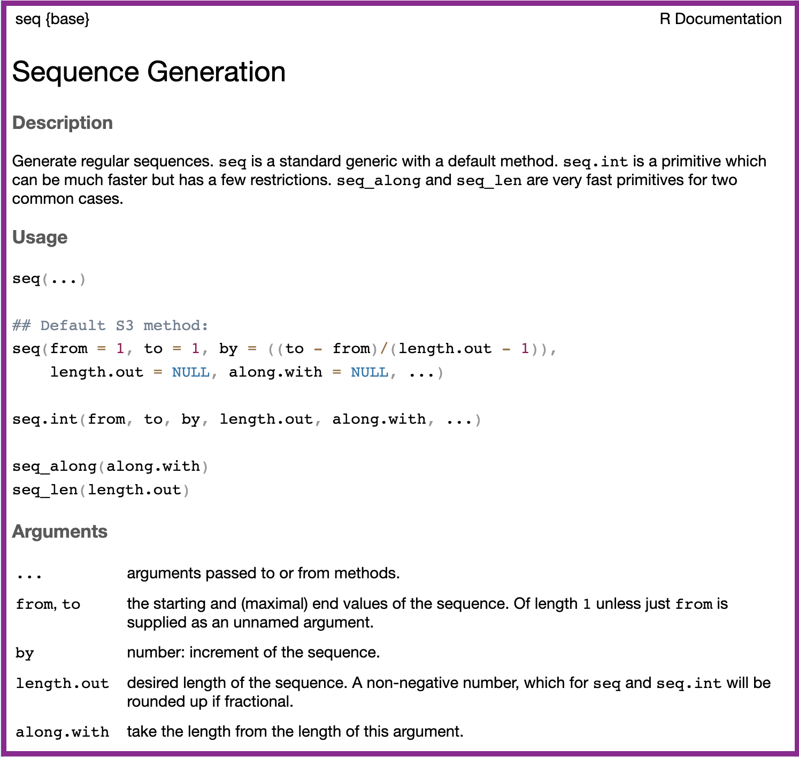

1. Pencil out how you would write code to create...

a. an object called `year` that contains the value `2020`
b. an object called `name` that contains the name of your high school

```{r}
#| echo: true
#| label: empty-code-block

```

</br>
</br>
</br>

2. Write down how you would expect to use the `c()` function to make a sequence
of numbers from `2015` to `2025`.

```{r}
c(
  
 
  
   
  
)
```

::: columns
::: {.column width="48%"}
3. Using the help file for `seq()`, pencil out how you would expect to use 
this function to make a sequence of numbers from `2015` to `2025`.

```{r}


```
 
:::

::: {.column width="4%"}
:::

::: {.column width="48%"}
{fig-alt="A screenshot of the help file for the seq function, which appears in the Help tab when you type `?seq` in the Console. The title of the help file says 'Sequence Generation', followed by a description of what the function does, 'Generate regular sequences.' The next section says 'Usage' and provides examples of how the seq function and its relatives (seq.int, seq_along, seq_len) are used. The final section is titled 'Arguments' and provides descriptions of each argument to the seq function. The key arguments are from, to, and by. The from argument declares where the sequence should start from, the to argument declares what value the sequence should go up to, and the by argument declares what increment the numbers should go by."}
:::
:::

4.  Fill out the Code Tracing Table for each line of code in the slides.

| Line | `x` | `y`             | `z`             |
|------|-----|-----------------|-----------------|
| 1    | 10  | Does not exist. | Does not exist. |
| 2    |     |                 |                 |
| 3    |     |                 |                 |
| 4    |     |                 |                 |
