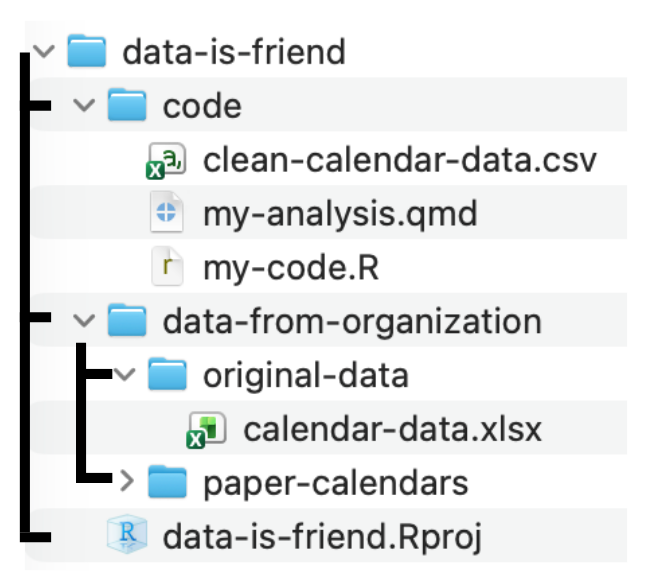

## Understanding your data context

Today we'll work with data from a community meal program. Volunteers record the number of meals served each day by writing the counts on a paper calendar. Later, someone enters those counts into a spreadsheet so they can summarize activity and report trends.

Throughout this activity, you'll follow the same data as it changes form from handwritten notes, to a wide spreadsheet (`calendar-data.xlsx`), to a long dataset (`clean-calendar-data.csv`) that is ready to visualize and analyze in R.

Before we write code, pause and ask: **data about whom, collected by whom, and for what purpose?**

Look at the paper version of the meal counts for the month of January.

```{r}
#| echo: false
#| fig-align: center
#| out-width: 70%
knitr::include_graphics("images/data-is-friend/data-from-organization/paper-calendars/january.png")
```

Fill in your first impressions:

- Who or what is this data about? \_\_\_\_\_\_\_\_\_\_\_\_\_\_\_\_\_\_\_\_\_\_\_\_\_\_\_\_\_\_
- Who might have collected it? \_\_\_\_\_\_\_\_\_\_\_\_\_\_\_\_\_\_\_\_\_\_\_\_\_\_\_\_\_\_\_\_\_
- What does one number seem to represent? \_\_\_\_\_\_\_\_\_\_\_\_\_\_\_\_\_\_\_\_\_\_
- What context would you want before analyzing it? \_\_\_\_\_\_\_\_\_\_\_\_\_\_

Now look at the spreadsheet version.

```{r}
#| echo: true
#| eval: false
library(readxl)
meal_counts_original <- read_csv("<PATH-TO-DATA>/04-calendar-data.xlsx")
```

```{r}
#| echo: false
library(readxl)
meal_counts_original <- read_excel("../data/04-calendar-data.xlsx")
meal_counts_original
```

- What does one row represent? \_\_\_\_\_\_\_\_\_\_\_\_\_\_\_\_\_\_\_\_\_\_\_\_\_\_\_\_\_\_\_\_\_
- What does one column represent? \_\_\_\_\_\_\_\_\_\_\_\_\_\_\_\_\_\_\_\_\_\_\_\_\_\_\_\_\_\_

## Reading in the data & following file paths

For each prompt below:

1.  Star the working directory folder, your "home base."
2.  Draw the route from the desired data set to your home base.
3.  Match the correct code and file path you would use to read in the data.

::: callout-note
### File Path Bank

``` r
readxl::read_excel("../data-from-organization/original-data/calendar-data.xlsx")
readxl::read_excel("data-from-organization/original-data/calendar-data.xlsx")
read_excel("calendar-data.xlsx")
read_csv("clean-calendar-data.csv")
read_csv("data-from-organization/original-data/clean-calendar-data.csv")
read_csv("../clean-calendar-data.csv")
```
:::

**Prompt 1:** You are working within `my-code.R` and want to read in `calendar-data.xlsx`.

```{r}
#| echo: false
#| fig-align: center
#| out-width: 35%

```

Code I would use:

``` r
```

**Prompt 2:** You are working within `my-analysis.qmd` and want to read in `calendar-data.xlsx`.

```{r}
#| echo: false
#| fig-align: center
#| out-width: 35%

```

Code I would use:

``` r
```

**Prompt 3:** You are working within `my-analysis.qmd` and want to read in `clean-calendar-data.csv`.

```{r}
#| echo: false
#| fig-align: center
#| out-width: 35%

```

Code I would use:

``` r
```

## Exploring the data structure

Here, we read in the longer version of the meal-count data (`clean-calendar-data.csv`).

```{r}
#| echo: true
#| eval: false
library(readr)
meal_counts <- read_csv("<PATH-TO-DATA>/clean-calendar-data.csv")
```

```{r}
#| echo: false
library(readr)
meal_counts <- read_csv("../data/04-clean-calendar-data.csv")
```

Use R to explore the data and answer each question:

```{r}
class(meal_counts)
names(meal_counts)
head(meal_counts, n = 6)
tibble::glimpse(meal_counts)
summary(meal_counts)
```

- What is the name of the data set object in the R environment? \_\_\_\_\_\_\_\_\_\_\_\_\_\_\_\_\_
- What kind of R object is `meal_counts`? \_\_\_\_\_\_\_\_\_\_\_\_\_\_\_\_\_\_\_\_\_\_\_
- How many rows are in the data? \_\_\_\_\_\_\_\_\_\_\_\_\_\_\_\_\_\_\_\_\_\_\_\_\_\_\_\_\_\_\_
- How many columns are in the data? \_\_\_\_\_\_\_\_\_\_\_\_\_\_\_\_\_\_\_\_\_\_\_\_\_\_\_\_
- What does one row represent now? \_\_\_\_\_\_\_\_\_\_\_\_\_\_\_\_\_\_\_\_\_\_\_\_\_\_\_\_\_
- Which variables are numeric? \_\_\_\_\_\_\_\_\_\_\_\_\_\_\_\_\_\_\_\_\_\_\_\_\_\_\_\_\_\_\_\_\_
- Which variables are categorical and give context? \_\_\_\_\_\_\_\_\_\_\_\_\_\_\_\_\_\_\_\_\_\_\_\_\_\_\_\_\_\_\_\_\_

### Shape-shifting data

The same information can be shaped into different rectangles. Complete the comparisons:

| Version | One row represents... | One column represents... | Best for... |
|------------------|------------------|------------------|------------------|
| Paper calendar | \_\_\_\_\_\_\_\_\_\_ | \_\_\_\_\_\_\_\_\_\_ | Recording meals |
| Spreadsheet/wide data | \_\_\_\_\_\_\_\_\_\_ | \_\_\_\_\_\_\_\_\_\_ | Sharing with coworkers/storing virtually |
| Longer data | \_\_\_\_\_\_\_\_\_\_ | \_\_\_\_\_\_\_\_\_\_ | *Certain* analysis in R |
