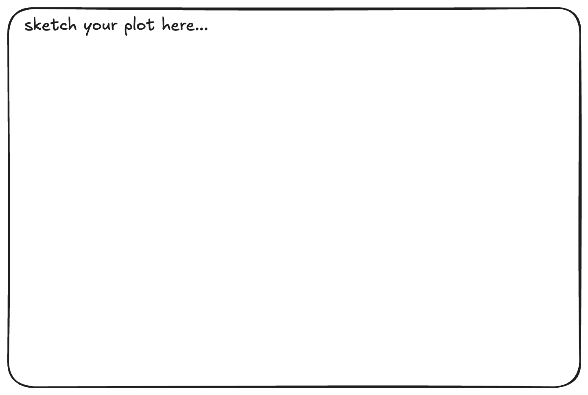

```{r}
library(tidyverse)
```

# Meet the Data

Before creating graphs, lets take a few minutes to understand the dataset. The dataset comes from the [the PalmTraits 1.0 database](https://www.nature.com/articles/s41597-019-0189-0) via the [`palmtrees`](https://github.com/EmilHvitfeldt/palmtrees) R package by [Emil Hvitfeldt](https://github.com/EmilHvitfeldt). The data set was curated by [Lydia Gibson](https://github.com/lgibson7).

Kissling, W. D., Balslev, H., Baker, W. J., Dransfield, J., Göldel, B., Lim, J. Y., & Svenning, J. C. (2019). PalmTraits 1.0, a species-level functional trait database of palms worldwide. *Scientific Data*, *6*(1), 178.

> Plant traits are critical to plant form and function —including growth, survival and reproduction— and therefore shape fundamental aspects of population and ecosystem dynamics as well as ecosystem services. Here, we present a global species-level compilation of key functional traits for palms (Arecaceae), a plant family with keystone importance in tropical and subtropical ecosystems.

Before looking at the data dictionary...

1.  Who or what do you think is represented in these data?
2.  Who might have collected these data, and what is one reason they would collect them?
3.  Do you think every palm species has complete information for every variables? Why or why not?
4.  Have you ever noticed different kinds of palm trees? Where?

### **Data Dictionary `palmtrees.csv`**

Answer the following questions using the data dictionary.

5.  What does one row in this dataset represent? One palm tree? One palm species? One forest?
6.  Find two numerical variables and two categorical variables.

| **variable** | **class** | **description** |
|------------------------|------------------------|------------------------|
| spec_name | character | Taxonomic name of species (binomial nomenclature) following the World Checklist of palms. |
| acc_genus | character | Accepted genus name from the World Checklist of palms. |
| acc_species | character | Accepted species name from the World Checklist of palms. |
| palm_tribe | character | Name of palm tribe from the World Checklist of palms. |
| palm_subfamily | character | Name of palm subfamily from the World Checklist of palms. |
| climbing | factor | Whether palm species has climbing habit or not, or both if populations vary in this trait. |
| acaulescent | factor | Whether palm species has an acaulescent growth form (leaves and inflorescence rise from the ground, i.e. lacking a visible aboveground stem) or not, or both if populations vary in this trait. |
| erect | factor | Whether palm species has an erect stem (rather than an acaulescent or climbing growth form) or not, or both if local populations vary in this trait. |
| stem_solitary | factor | Whether stems are solitary (single-stemmed) or clustered (with several stems), or both if populations vary in this trait. |
| stem_armed | factor | Whether bearing some form of spines at the stem or not, or both if populations vary in this trait. |
| leaves_armed | factor | Whether bearing some form of spines on the leaves or not, or both if populations vary in this trait. |
| max_stem_height_m | double | Maximum stem height. |
| max_stem_dia_cm | double | Maximum stem diameter. |
| understorey_canopy | factor\<27915\> | Understory palms are defined as short-stemmed palms with a maximum stem height ≤5m or an acaulescent growth form, canopy palms with maximum stem height \>5m. |
| max_leaf_number | integer | Maximum number of leaves. |
| max\_\_blade\_\_length_m | double | Maximum length of the blade (the flat expanded part of a leaf as distinguished from the petiole). |
| max\_\_rachis\_\_length_m | double | Maximum length of the rachis (the axis of the leaf beyond the petiole). |
| max\_\_petiole_length_m | double | Maximum length of the petiole (the stalk of the leave). |
| average_fruit_length_cm | double | Average length of the fruit as provided in a monograph or species description. |
| min_fruit_length_cm | double | Minimum fruit length as provided in a monograph or species description. |
| max_fruit_length_cm | double | Maximum fruit length as provided in a monograph or species description. |
| average_fruit_width_cm | double | Average width of the fruit as provided in a monograph or species description. |
| min_fruit_width_cm | double | Minimum fruit width as provided in a monograph or species description. |
| max_fruit_width_cm | double | Maximum fruit width as provided in a monograph or species description. |
| fruit_size_categorical | factor | Species classified into small-fruited palms (fruits \<4cm in length) and large-fruited palms (fruits ≥4cm in length). |
| fruit_shape | factor | Description of fruit shape as provided in a monograph or species description. |
| fruit_color_description | character | Verbatim description of fruit color (e.g. red to dark purple, green to orange to red, purple-brown) as provided in a monograph or species description. |
| main_fruit_colors | character | Main fruit colors summarized from fruit color descriptions (black, yellow, orange, red, purple etc.). |
| conspicuousness | factor | Main fruit colors classified into conspicuous colors (e.g. orange, red, yellow, pink, crimson, scarlet) vs. cryptic colors (brown, black, green, blue, cream, grey, ivory, straw-coloured, white, purple). |

# Grammar of Graphics

Think of a graph or a data visualization as a mapping…

…**FROM variables** in the data set (or statistics computed from the data)…

…**TO visual attributes** (or “aesthetics”) **of marks** (or “geometric elements”) on the page/screen.

## How to Build a Graphic with `ggplot2`

```{r}
#| echo: false
#| fig-align: center

```

3.  **What do you expect to see after running the following code? Sketch it in the box above.**

```{r}
#| eval: false
#| echo: true
library(ggplot2)

ggplot(data = palmtrees)
```

4.  **What do you expect to see after running the following code? Add to your sketch in the box above.**

```{r}
#| eval: false
#| echo: true
ggplot(data = palmtrees,
       mapping = aes(x = palm_subfamily, y = max_stem_height_m)
       )
```

5.  **What do you expect to see after running the following code? Add to your sketch in the box above.**

```{r}
#| eval: false
#| echo: true
ggplot(data = palmtrees,
       mapping = aes(x = palm_subfamily, y = max_stem_height_m)
       ) +
  geom_boxplot()
```

6.  **What do you expect to see after running the following code? Add to your sketch in the box above.**

```{r}
ggplot(data = palmtrees,
       mapping = aes(x = palm_subfamily, y = max_stem_height_m)
) +
  geom_boxplot() +
  geom_jitter(alpha = 0.1)
```

## `aes`thetics & `geom`etries

:::: columns
::: column
**Common aesthetics**

- x, y

- color, fill

- linetype

- shape

- size
:::
::: column
**Common geometries**

- geom_bar()

- geom_density()

- geom_histogram()

- geom_boxplot()

- geom_point()

- geom_line()
:::
::::

We will explore:

- How does the sizes of the different species of palms vary across sub families?

- Which fruit colors occur most often?

## Practice Activity Warm-up

In the PA today, you will read in the data and create graphs to explore:

- Which fruit shapes occur most often?

- How does the sizes of the different species of palms vary across sub families?

### Create a plot showing the number of palm tree species with each fruit shape (ovoid, globose, elongate, rounded, ellipsoid, pyramidal, fusiform).

::::: columns
::: column
```{r}
#| echo: false
palmtrees |> 
  select(spec_name, palm_subfamily, fruit_shape, max_stem_height_m, max_stem_dia_cm) |> 
    head() |> 
    knitr::kable()
```
:::

::: column
```{r}
#| echo: false
#| fig-align: center

```
:::
:::::

Sketch an appropriate plot and map the variables from in the condensed dataset above. Carefully consider the following:

- What type of variable is `fruit_shape`?
- What type of plot would you make for this type of variable?
- What `geom` would you use?

### Create a plot showing the relationship between a palm tree species max stem height (m) and max stem diameter (cm) differentiating species by the palm subfamilies.

::::: columns
::: column
```{r}
#| echo: false
palmtrees |> 
  select(spec_name, palm_subfamily, fruit_shape, max_stem_height_m, max_stem_dia_cm) |> 
    head() |> 
    knitr::kable()
```
:::

::: column
```{r}
#| echo: false
#| fig-align: center

```
:::
:::::

Sketch an appropriate plot and map the variables from in the condensed dataset above. Carefully consider the following:

- What type of variables are `max_stem_height_m` and `max_stem_dia_cm`?
- What type of plot would you make for this type of variable?
- What `geom` would you use?
- How would you incorporate the subfamily? What type of variable is `palm_subfamily`?
