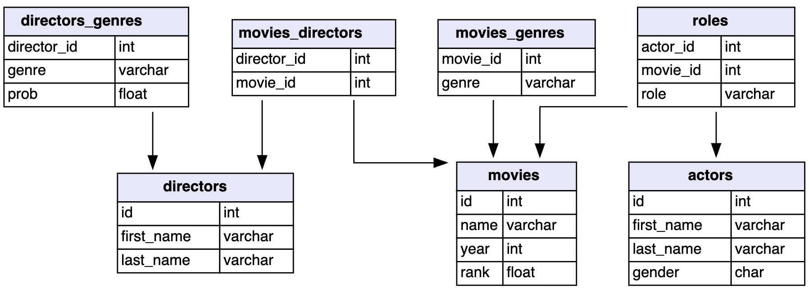

```{r}
#| label: setup
#| echo: false

library(tidyverse)
```

:::callout-warning

In progress! For class, I am imagining this would be rendered as a .docx and need some editing to be filled out by students.
:::

We have 7 datasets that relate to movies from IMDb's database, as shown in the graphic below. 


1. Just looking at the graphic, draw lines between the variables that you think are the keys between the different datasets.

```{r}
#| echo: false

load("../data/08-imdb_data.Rdata")
```

2. 


```{r}
#| echo: false

directors <- directors |> 
  filter(last_name %in% c("Lucas",
                          "Coppola",
                          "Coen")) |> 
  add_row(id = 842813,
          first_name = "Greta",
          last_name = "Gerwig")
           

xwalk <- movies_directors |> 
  inner_join(directors,
            by = join_by(director_id == id) ) |> 
  pull(movie_id)

movies <- movies |> 
  filter(id %in% xwalk |
           name %in% c("Shrek",
                       "Little Mermaid, The",
                       "Ocean's Eleven"))

movies_directors <- movies_directors |> 
  filter(movie_id %in% movies$id |
           director_id %in% directors$id)
```

:::columns

:::{.column width=45%}

```{r}
directors
```

:::

:::{.column width=5%}

:::

:::{.column width=45%}


```{r}
movies
```
:::
:::


3. Fill in the columns below as if we completed this join. Leave elements blank that would be missing!

```{r}
#| eval: false
movies_directors |> 
  left_join(directors,
            by = join_by(director_id == id)) |> 
  left_join(movies, 
            by = join_by(movie_id == id))
```


```{r}
#| echo: false

movies_directors |> 
  mutate(first_name = "",
         last_name = "",
         movie_name = "")
```
