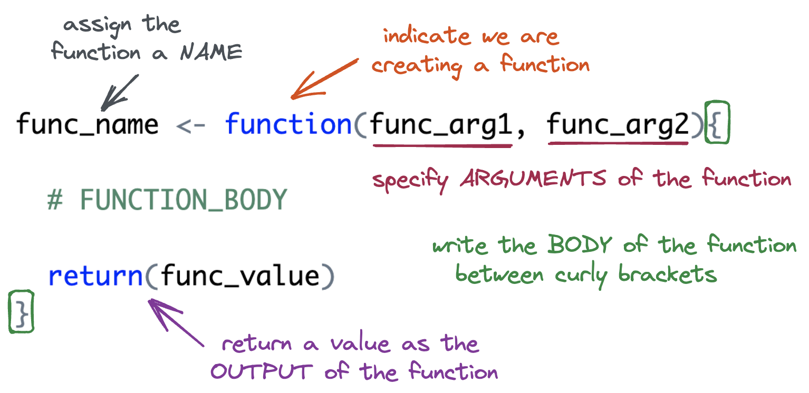

# Review: Writing Functions in R

{fig-alt="Illustration of R function syntax. The image explains the parts of a function in R using labeled arrows and colors. At the top, the name 'func_name' is assigned using '<-' to a function. An arrow points to 'func_name' with the label 'assign the function a NAME.' The keyword 'function' is highlighted, with an arrow labeled 'indicate we are creating a function.' The parentheses contain 'func_arg1, func_arg2,' which are labeled as 'specify ARGUMENTS of the function.' The body of the function is placed between curly brackets and labeled 'write the BODY of the function between curly brackets.' Finally, the 'return(func_value)' statement is labeled 'return a value as the OUTPUT of the function."}


1. Design a function named `add_two()` that will add `2` to whatever number is
input. In your function what is the:

- Function Name:


- Function Argument(s):


- Function Body:


- Function Return:


2. What if we wanted to write a more general function, named `add_something()`. 
The function would take **two** inputs: 

1. `x` the vector to add to
2. `something` the value to add to `x`

How would your function change?


4. Are your arguments ***optional*** or ***required***?  What is the difference? 


# More complicated functions

5. Fill in the code below to create a function named `above_average()`. The
function should keep only the elements of `x` greater than the mean.

```{r}
#| echo: true

above_average <- function(x) {

  mean_x <- ______________
  
  x[__________________]
  
  
}
```


6. Write down the steps you would need to create a function named `every_third()` 
that takes in a vector and returns every third element from that vector 
(i.e., indices 1, 4, 7, 10, etc.). 

**Think about:**

- What inputs the function should take.
- How to identify which positions in the vector are "every third."
- How to select those elements from the vector.

