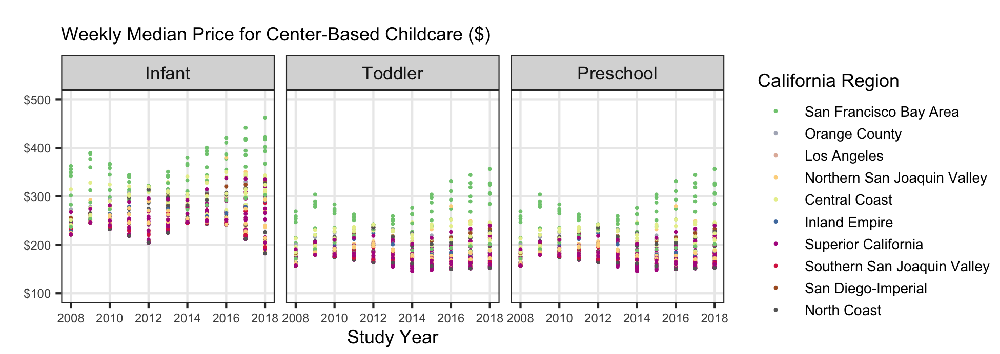

**0. Load the appropriate libraries and the data.**

```{r}
#| label: setup

# load libraries
```

```{r}
#| label: load_data

# load data
childcare_costs <- read_csv('https://raw.githubusercontent.com/rfordatascience/tidytuesday/master/data/2023/2023-05-09/childcare_costs.csv')
counties <- read_csv('https://raw.githubusercontent.com/rfordatascience/tidytuesday/master/data/2023/2023-05-09/counties.csv')

tax_rev <- read_csv('https://raw.githubusercontent.com/r-is-your-friend/course-assessments/main/data/08-ca_tax_revenue.csv')
```

1. Briefly describe the data (~ 3 sentences). What information does it contain?

## California Childcare Costs

2. Let's focus only on California. Create a `ca_childcare` dataset containing (1) county information and (2) all information from the `childcare_costs` dataset.

a. Sketch a plan for completing this task and include an image of the sketch or write out the steps of your plan in plain English (not with function names!). You should do all of this within one pipeline

b. Implement/code your game plan to create the dataset of childcare costs in California. *Checkpoint: There are 58 counties in CA and 11 years in the dataset. Therefore, your new dataset should have 638 observations.*

```{r}
# code for Q2
```

3. Now, let's add the tax revenue information to the `ca_childcare` dataset. Add the data from `tax_rev` for the counties and years that are already in the `ca_childcare` data. Overwrite the old `ca_childcare` data with this dataset. *Checkpoint: you are just adding columns here, so your new dataset should still have 638 observations*

```{r}
# code for Q3
```

4. Using a function from the `forcats` package, complete the code below to create a new variable where each county is categorized into one of the [10 Census regions](https://census.ca.gov/regions/) in California. Use the Region description (from the plot), not the Region number (e.g. "Superior California" not "1"). 

The code below will help you get started.

```{r}
#| code-fold: true

# defining 10 census regions

superior_counties <- c("Butte","Colusa","El Dorado",
                       "Glenn","Lassen","Modoc",
                       "Nevada","Placer","Plumas",
                       "Sacramento","Shasta","Sierra","Siskiyou",
                       "Sutter","Tehama","Yolo","Yuba")

north_coast_counties <- c("Del Norte","Humboldt","Lake",
                          "Mendocino","Napa","Sonoma","Trinity")

san_fran_counties <- c("Alameda","Contra Costa","Marin",
                       "San Francisco","San Mateo","Santa Clara",
                       "Solano")

n_san_joaquin_counties <- c("Alpine","Amador","Calaveras","Madera",
                            "Mariposa","Merced","Mono","San Joaquin",
                            "Stanislaus","Tuolumne")

central_coast_counties <- c("Monterey","San Benito","San Luis Obispo",
                            "Santa Barbara","Santa Cruz","Ventura")

s_san_joaquin_counties <- c("Fresno","Inyo","Kern","Kings","Tulare")

inland_counties <- c("Riverside","San Bernardino")

la_county <- "Los Angeles"

orange_county  <- "Orange"

san_diego_imperial_counties <- c("Imperial","San Diego")
```

```{r}
# finish this code for Q4

ca_childcare <- ca_childcare |> 
  mutate(county_name = str_remove(county_name, " County"))

```

::: callout-tip

I have provided you with code that eliminates the word "County" from each of the county names in your `ca_childcare` dataset. You should keep this line of code and pipe into the rest of your data manipulations.

You will learn about the `str_remove()` function from the `stringr` package next week!

:::

5. Let's consider the median household income of each region, and how that income has changed over time. Create a table with ten rows, one for each region, and three columns, 2008 income, 2018  income, and region. The cells should contain the `median()` of the median household income (expressed in 2018 dollars) of the `region` and the `study_year`. Order the rows by 2018 values from highest income to lowest income.

::: callout-tip

This will require transforming your data! Sketch out what you want the data to look like before you begin to code. You should be starting with your California dataset that contains the regions.

:::

```{r}
# code for Q5
```

6. Which California `region` had the lowest `median` full-time median weekly price for center-based childcare for infants in 2018? Does this `region` correspond to the `region` with the lowest `median` income in 2018 that you found in Q5?

::: callout-warning

The code for the first question should give me the EXACT answer. This means having the code output the exact row(s) and variable(s) necessary for providing the solution. To answer the second question, compare this output with the output from Q5.

:::

```{r}
# code for Q6
```

7. The following plot shows, for all ten regions, the change over time of the full-time median price for center-based childcare for infants, toddlers, and preschoolers.

  a.  Recreate the plot. You do not have to replicate the exact colors or theme, but your plot should have the same content, including the order of the facets and legend, reader-friendly labels, and axes breaks.

:::callout-tip
# Hints
This will require transforming your data! Sketch out what you want the data to look like before you begin to code. You should be starting with your California dataset that contains the regions.

A point on the plot represents one *county* and year.

You should use a `forcats` function to reorder the legend automatically

Try setting `aspect.ratio = 1` in `theme()` if your plot is squished

Again, your plot does not need to look exactly like this one!!

Remember to avoid "object junk" in your environment!
:::



```{r}
# code for Q7
```

  b. Hmmm we can sort of see a pattern but it is a bit difficult with all of the different points for counties and colors for regions. Let's add a trend line to help! Since there is more than one data point per region, it doesn't make sense to use `geom_line()` to add a trend line. Instead, we can add a Loess smooth line for each region. You don't need to copy-and paste your code from part a, just add Loess smooth lines to the code for your plot above.

:::callout-warning
## Don't go too hard with `geom_smooth()`

The final plot makes use of smoothed lines to help the viewer see patterns over time, that might be difficult by just looking at the points for each county. However, it is important that we have also included the points! The smoothed lines are based on a **statistical model**, so only including these smoothed lines would be misleading. By including both, the viewer can see how the smoothed lines relate to the original data.

It also wouldn't make much sense to use a Loess smoother if there was just one point per region and year! In that case, we should just use a line plot with `geom_line()`.

:::
