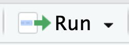
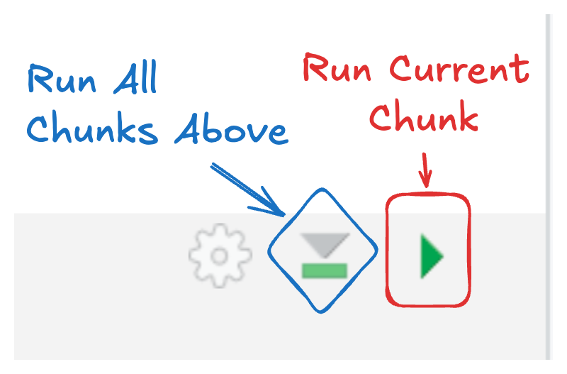

:::{.version-solution}

```{r}
#| label: setup

library(tidyverse)
library(knitr)
library(readxl)
```

:::

:::{.version-instructions}

[Download 04-magic-csv.csv](../../data/04-magic-csv.csv)

[Download 04-clue-data.xlsx](../../data/04-clue-data.xlsx)


## Intro to Quarto

### Create your PA 4 Quarto File


1.  In RStudio, go to `File` \> `New File` \> `Quarto Document...` and click on `Create Empty Document` in the bottom left corner of the dialog box **without changing anything**.

2. Save your new Quarto file in an appropriate directory inside your `stat-1810` folder like `"pas"` or `"week-4"` and name the file something descriptive like `"pa4.qmd"`.

:::callout-tip
# Good file naming

You should name files to describe what the file is and without any spaces in the name!
:::

3. Change the title of your document to be "PA 4: Emoji Riddles"

4.  Add additional lines to your YAML header:

-   add a line with `author: ` and your name.
-   add a line with `format: html`
-   add a line with `embed-resources: true`.
-   add a line with `code-tools: true`.


### Add Code and Text

The beauty of Quarto is integrating code chunks along with nicely formatted text! 


3. Insert a `R` code chunk at the beginning of the document.
:::

:::{.version-solution}

## First Quarto Code Chunk!

```{r}
2 + 7
```

**This** code chunk adds two to *seven*.
:::

:::{.version-instructions}

:::{.callout-note collapse="true"}
## Creating a Code Chunk
There are four different ways to do this:

a. Recommended:  type <kbd>ctrl</kbd> + <kbd>alt</kbd> + <kbd>i</kbd> on Windows, or <kbd>⌘</kbd> + <kbd>⌥</kbd> + <kbd>i</kbd> on macOS,

b.  Click on the  symbol. This should automatically default to R code, but if you have a Python compiler on your computer, you might need to select "R" from the options.

c.  If you are using the Visual editor, click on the "Insert" button, then select "Code Chunk", and finally select "R".

d.  Manually add the code chunk by typing ```` ```{r} ````. Make sure to close your code chunk with ```` ``` ````.

:::

4. Write code to add your two favorite numbers in the code chunk and run your code. Practice the different ways you can run code in Quarto!

:::{.callout-note collapse="true"}
# Running code in Quarto

You can run code in Quarto the exact same way that you have in R scripts, with a couple more options!

To run one line or a specific set of code (same as R scripts):

- Click within one line or highlight desired code + <kbd>ctrl</kbd> + <kbd>enter</kbd> on Windows, or <kbd>⌘</kbd> + <kbd>return</kbd>  on macOS,
- Click within one line or highlight desired code and click the {width=10%} button in Rstudio.

To run by chunk (new to Quarto!):

:::columns
:::{.column width=60%}
- To run all code in a **current chunk**, click the green arrow pointing to the right, at the top right corner of the code chunk (pictured here).
- To run **all chunks above** the current chunk, click the down grey arrow to a green bar, at the top right corner of the code chunk.
:::
:::{.column width=40%}
{width=70% fig-align="center"}
:::
:::

:::


5. Write a sentence in Markdown, below your code chunk explaining what the code does. [Bold](https://quarto.org/docs/authoring/markdown-basics.html#text-formatting) the first word of your sentence and italicize the last word!

6. Add a **level 2** [heading](https://quarto.org/docs/authoring/markdown-basics.html#headings) *above* your code chunk called "First Quarto Code Chunk!"

7. Render your document! 

:::callout-tip
# Rendering options

Do you like viewing the rendered document in the Viewer pane or in a separate browser window? You can change this default using the options in the gear icon next to the Render button.
:::


## Read in Puzzle Data

### Setup

8. Download "04-magic-data.csv" and "04-clue-data.xlsx" and save them in your an appropriate directory inside your stat-1810 directory. Think about where would be the easiest for reading the data into your `pa4.qmd` file!

9. It is best practice to always have a code chunk at the beginning of your quarto document to load packages and read in data labeled as "setup". Add a code chunk after the YAML header. Include a [label](https://quarto.org/docs/computations/r.html#chunk-labels) for this chunk called "setup". Load the tidyverse package in this chunk.

:::callout-important
## Label code chunks!

It is best practice to include informative labels for all of your code chunks. Code chunk labels cannot have spaces in them so will be things like `read-in-data`.

:::

10. Create another level two header at the end of your document called "Crack the Code"


### Read in Codes

11. Below the header you created in Q10, create a new R code chunk. Use `read_csv()` to read in "04-magic-data.csv" save it as `emoji_codes`.

12. Double click on `emoji_codes` in Environment to look a the dataset. 

Look at the dataset that popped up in your source window.

- what are the rows and columns?
- what in the world is this data???

Look down at your console 

- what code was run?


13. Print (i.e. return) the `emoji_codes` data in a new chunk. See what it looks like. We call this returning code "in-line". 

14. To actually see our secret messages, you need to convert the tibble into a nice HTML table. Luckily there is a handy function to do that! `kable()` is part of the `knitr` package. Add knitr to your loaded packages in your setup chunk and install it if needed. Create a new code chunk with the following code: `kable(emoji_codes)`.


Now you should see three emoji puzzles!

:::

:::{.version-solution}
## Crack the Code

```{r}
#| label: read-emojis

emoji_codes <- read_csv("../../data/04-magic-csv.csv")
```


```{r}
#| label: read-codes

kable(emoji_codes)
```


:::

:::{.version-instructions}
### Read in Clues

To help you decipher the puzzles, we have also provided clues in "04-clue-data.xlsx". 

But being the devious folks that professors are, the clues are in a hidden sheet called "clues".

15. Using `read_xlsx()`, read in the hidden sheet called "clues" from the "04-clue-data.xlsx" file and save it as an object called `emoji_clues`. Don't forget to to load the `readxl` package in your startup chunk!

16. Explore the `emoji_clues` data with `glimpse()` `str()` `head()`. 

:::

:::{.version-solution}

```{r}
emoji_clues <- read_xlsx("../../data/04-clue-data.xlsx",
                         sheet = "clues")
```

```{r}
str(emoji_clues)
```

```{r}
glimpse(emoji_clues)
```
```{r}
head(emoji_clues, n = 1)
```

```{r}
kable(emoji_clues)
```

:::callout-tip
# Canvas Submission
What do all of the answers to the riddles have in common?

☕️*COFFEE*☕️
:::


:::

:::{.version-instructions}
## Code Cracking

17. Use the clues to help you decipher each of the three emoji riddles!


:::callout-tip
# Canvas Submission
What do all of the answers to the riddles have in common?
:::

:::