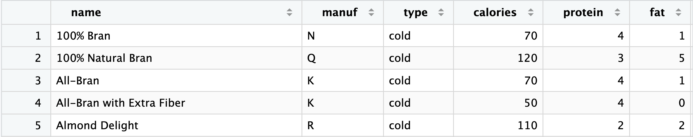
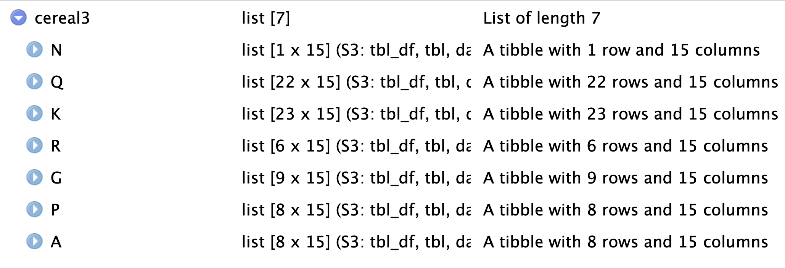
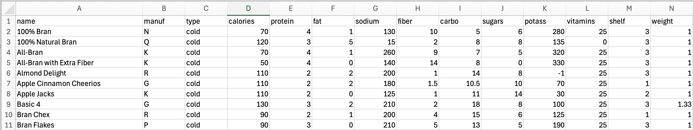
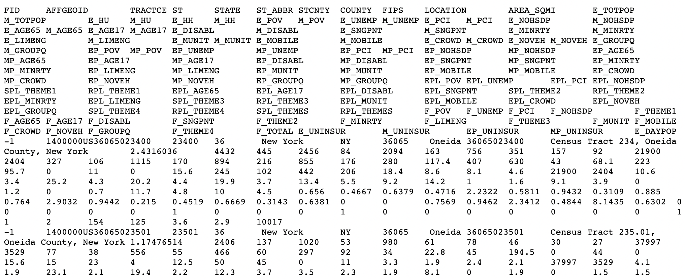
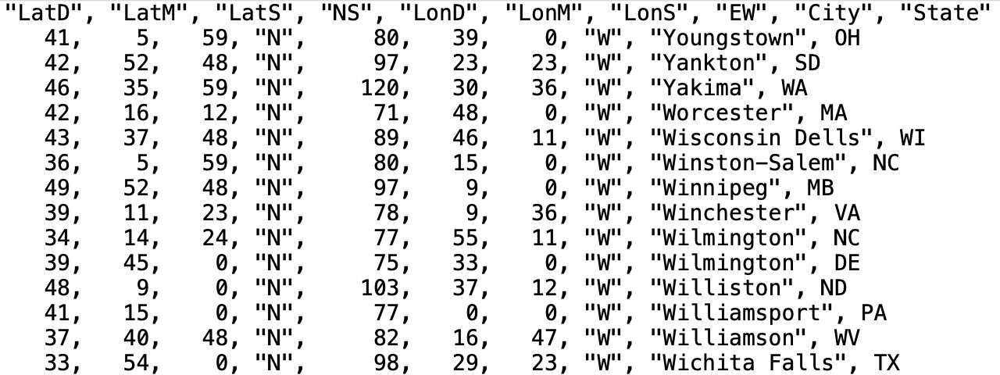
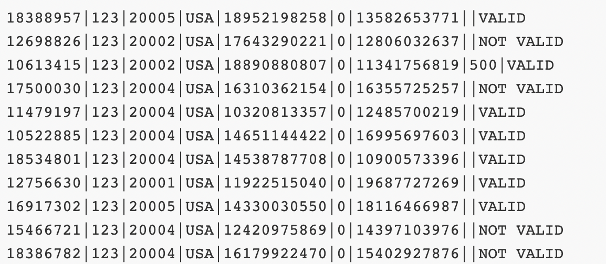
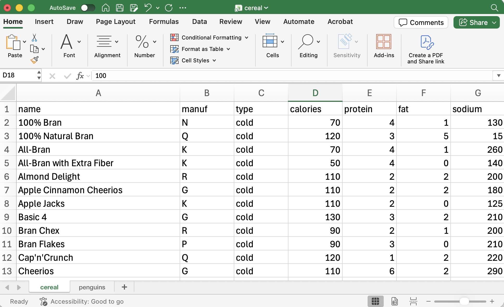
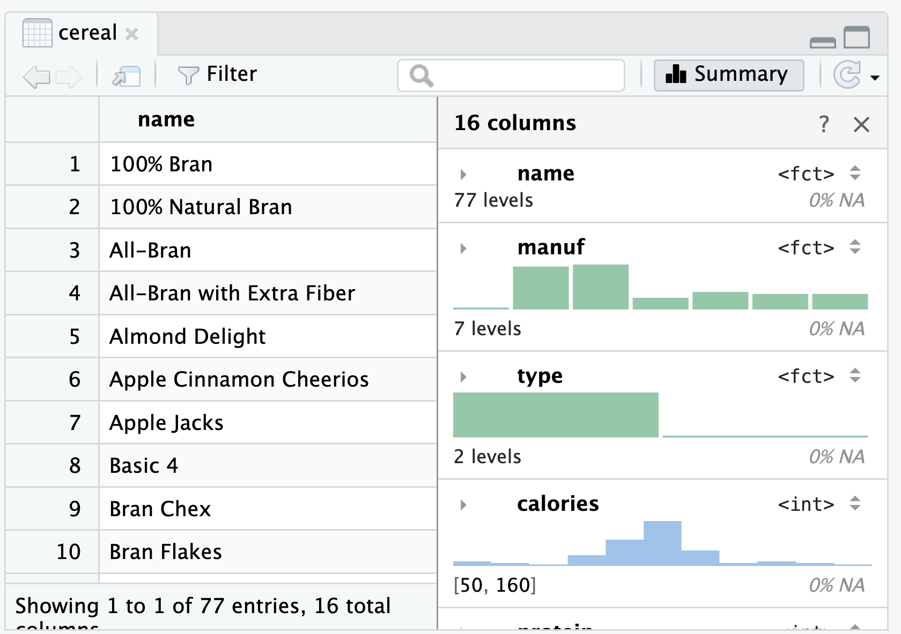

```{r}
#| include: false
#| label: packages-setup

library(tidyverse)
```


::: columns
::: {.column width="48%"}
#### 📖 Readings: 70 min

#### 🏋🏾‍♂️ Activities: 10 min

:::

::: {.column width="4%"}
:::

::: {.column width="48%"}
#### 📽 Videos: 0 min 

#### 💻 Tutorials: 0 min
:::
:::

------------------------------------------------------------------------


::: callout
## Learning Objectives

+ Consider context of data and describe data based on a data dictionary.
+ Explore rectangular data quickly in R (with code and with RStudio visually)
+ Read rectangular data with various delimiters into R using an appropriate `readr` or `readxl` function
+ Define relative versus absolute file paths
+ Integrate R code and Markdown text in **Quarto** documents
:::

## Welcome to the tidyverse

### 📖 Required Reading: [Welcome to the Tidyverse](https://r-is-your-friend.github.io/course-pack/04-data-is-friend.html#welcome-to-the-tidyverse)


## Rectangular Data

### 📖 Required Reading: [Getting Acquainted with our Data](https://r-is-your-friend.github.io/course-pack/04-data-is-friend.html#getting-acquainted-with-our-data)

- Don't continue reading the Project Management section yet!


By the end of the reading, you should be able to answer the following questions:

::: {.callout-check-in}

A classic dataset used to introduce data science concepts is the `cereal` data. The `cereal` data is part of the **liver** package in R. Load the data using the same code we saw for the `penguins` dataset:

```{r}
# load liver package
library(liver)

# import cereal data
data(cereal)
```

Look up the *data dictionary* for the `cereal` data. Running the code below, or going to the [documentation online](https://search.r-project.org/CRAN/refmans/liver/html/cereal.html).

```{r}
?cereal
```

1. What is one row in this dataset?


2. If you follow the string of sources for the data, you will end up at [this description](https://lib.stat.cmu.edu/datasets/1993.expo/README), from the 1993 American Statistical Association (ASA) Statistical Graphics Exposition. 

- getting at influences on the data... need to write this question
- impacts of FDA on data -- nutrition labels mandated in 1990.


3. What cultural context does this data pertain to?

<!--Want to improve this-->

a. United States groceries
b. Worldwide groceries
c. It is unclear
d. California groceries

4. Which of the following versions of the data would be considered **rectangular** data? Select all that apply.

::: {layout-nrow=2}

{width=50%}



 




:::
:::

## Importing Data into R


### 📖 Required Reading: [R4DS 7.1-7.3](https://r4ds.hadley.nz/data-import.html) about reading in data files
### 📖 Required Reading: [R4DS 7.5](https://r4ds.hadley.nz/data-import.html#sec-writing-to-a-file) about saving data externally
### 📖 Required Reading: [R4DS 20](https://r4ds.hadley.nz/spreadsheets.html) about working with Excel files

By the end of the reading, you should be able to answer the following questions:

::: {.callout-check-in}

5. Match the function with the data file to read it into R.

:::columns
:::{.column width=40%}

A. `read_csv(__)`

B. `read_xlsx(__)`

C. `read_delim(__, delim = "|")`

:::
:::{.column width=60%}


:::panel-tabset

## Data 1



## Data 2


## Data 3



## Data 4



:::
:::
:::

6. Match the exploratory data function with the output. 

:::columns
:::{.column width=20%}
A. `View(cereal)`

B. `str(cereal)`

C. `head(cereal)`
:::

:::{.column width=80%}


:::panel-tabset

## Output 1

```{r}
#| echo: false

str(cereal)
```


## Output 2
```{r}
#| echo: false

head(cereal)
```

## Output 3
{width=80% fig-pos="center"}
:::

:::
:::

:::

## Project Management


### 📖 Required Reading: [R4DS 28](https://r4ds.hadley.nz/quarto.html) about Quarto

- You can focus on 28.1-28.5 for now, but you will want to read the rest of the chapter eventually!

::: {.callout-check-in}

7.  How does Quarto know that a section of text is R code -- i.e. what symbols is Quarto looking for? 

:::columns

:::column

a.

`#| r`


b. 

` ```{r} `

` ``` `
:::
:::column
c. 

` '''{r} `

` ''' `

d. 

` {r} `
:::
:::

8. When written in *Markdown* in a Quarto document, a \# defines a...

a. heading
b. code chunk option
c. comment
d. plain text

:::

### 📖 Required Reading: [RStudio Projects](https://r-is-your-friend.github.io/course-pack/04-data-is-friend.html#rstudio-projects)

::: {.callout-check-in}

9. Follow the instructions to create your `stat-1810` RStudio project in `stat-1810` you have already been working with in class. 

Submit a screenshot showing your `stat-1810` directory, making sure the `stat-1810.Rproj` file is visible like: {width=40%}.

:::

### 📖 Required Reading: [File Paths](https://r-is-your-friend.github.io/course-pack/04-data-is-friend.html#file-paths-refresher)

By the end of the reading, you should be able to answer the following questions:


::: {.callout-check-in}

10. For each of the following file paths, are they a relative or absolute file path?

a. `"cereal.csv"`
b. `"/Users/charlixcx/Documents/stat-1810/week4/cereal.csv"`
c. `"../week4/cereal.csv"`
c. `"week4/cereal.csv"`

11. Which of the file paths from Q10 would give a correct *relative* file path to `"cereal.csv"` if you are working in `"explore_cereal.qmd"` with the following directory structure:

```
Documents
   |
   - stat-1810
       |
       - week1
       - week2
       - week3
            |
            - "lab3.R"
       - week4
            |
            - "cereal.csv"
            - "explore_cereal.qmd"
```

:::
