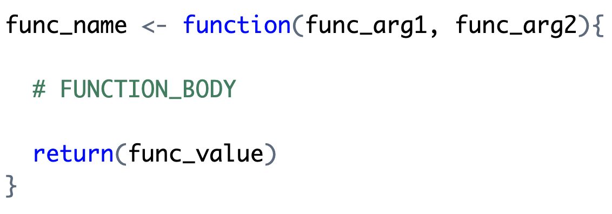

```{r}
#| include: false
#| message: false
#| label: set-up

library(tidyverse)
library(palmerpenguins)
library(countdown)

```

## Why write functions?

Functions allow you to automate common tasks!

</br>

**Writing functions has three big advantages over copy-paste:**

1. Your code is easier to read.
2. To change your analysis, simply change one function.
3. You avoid mistakes.

# Function Basics

## Function Syntax

<br>

{width=90% fig-alt="Basic syntax of a function in R. The function 'func_name' is assigned using '<-' to 'function(func_arg1, func_arg2)'. The body of the function is enclosed in curly brackets. Inside the brackets, there is a placeholder comment labeled '# FUNCTION_BODY' and a 'return(func_value)' statement indicating the output of the function."}


## Function Syntax

{fig-alt="Illustration of R function syntax. The image explains the parts of a function in R using labeled arrows and colors. At the top, the name 'func_name' is assigned using '<-' to a function. An arrow points to 'func_name' with the label 'assign the function a NAME.' The keyword 'function' is highlighted, with an arrow labeled 'indicate we are creating a function.' The parentheses contain 'func_arg1, func_arg2,' which are labeled as 'specify ARGUMENTS of the function.' The body of the function is placed between curly brackets and labeled 'write the BODY of the function between curly brackets.' Finally, the 'return(func_value)' statement is labeled 'return a value as the OUTPUT of the function."}


## A (Very) Simple Function

</br>
</br>

::: {.large}
Write a function named `add_two()` that will add `2` to whatever number is
input. 
:::

```{r}
#| echo: false

countdown(minutes = 3)
```


. . .

</br>

::: {.callout-tip}
# Compare Your Function with Your Neighbor

In what ways are your functions the same? In what ways do they differ?
:::

## Function Names

The **name** of the function is chosen by the author.

```{r}
#| echo: true
#| eval: false
#| code-line-numbers: false

add_two <- function(x){
  return(x + 2)
}
```

. . .

</br>

::: {.callout-caution}
## Function names have no inherent meaning.

The name you give to a function does not affect what the function does.

```{r}
#| echo: true
#| code-line-numbers: false

add_three <- function(x){
  return(x + 7)
}
```

```{r}
#| echo: true
#| code-line-numbers: false
add_three(5)
```
:::

## Function Arguments 

The **argument(s)** of the function are chosen by the author.

+ Arguments are how we pass external values into the function.
+ They are temporary variables that only exist inside the function body.

. . .

:::: {.columns}
::: {.column width="50%"}
::: {.midi}
+ We give them general names:
  + `x`, `y`, `z` -- vectors
  + `df` -- data frame
  + `i`, `j` -- indices
:::
:::
::: {.column width="50%"}

<br>

```{r}
#| echo: true
#| eval: false
#| code-line-numbers: false

add_two <- function(x){
  return(x + 2)
}
```

:::
::::

## Function Arguments 

What if we wanted to write a more general function, named `add_something()`. 
The function would take **two** inputs: 

1. `x` the vector to add to
2. `something` the value to add to `x`

How would your function change?

```{r}
#| echo: false

countdown(minutes = 2)
```

## Function Arguments 

::: panel-tabset

### Required Arguments

If we **do not** supply a default value when *defining* the function, the
argument is **required** when *calling* the function.

```{r}
#| echo: true
#| error: true
#| code-line-numbers: false

add_something <- function(x, something){
  x + something
}
```

::: {.fragment}
::: columns
::: {.column width="50%"}
```{r}
#| code-line-numbers: false
#| echo: true

add_something(x = 2, 
              something = 3)
```

:::

::: {.column width="50%"}
```{r}
#| error: true
#| code-line-numbers: false
#| echo: true

add_something(x = 2)
```

:::
:::
:::

### Optional Arguments

If we supply a **default** value when *defining* the function, the argument is
**optional** when *calling* the function.

```{r}
#| echo: true
#| code-line-numbers: false

add_something <- function(x, something = 2){
  return(x + something)
}
```

::: {.fragment}
::: columns
::: {.column width="50%"}
```{r}
#| code-line-numbers: false
#| echo: true

add_something(x = 5, 
              something = 6)
```
:::

::: {.column width="50%"}
If a value is not supplied, `something` defaults to 2.

```{r}
#| error: true
#| code-line-numbers: false
#| echo: true

add_something(x = 5)
```
:::
:::
:::
:::

## Optional Arguments

A lot of the functions we've been working with so far have optional arguments: 

</br>

```
mean(x, 
     trim = 0, 
     na.rm = FALSE, ...)
```

```
max(..., na.rm = FALSE)
min(..., na.rm = FALSE)
```

## Body: `{  }`

The **body** of the function is where the action happens.

+ The body must be specified within a set of curly brackets.
+ The code in the body will be executed (in order) whenever the function is
called.

</br>

```{r}
#| echo: true
#| eval: false
#| code-line-numbers: "2"

add_something <- function(x, something = 2){
  x + something
}
```


## Output: Last Value

Your function will *give back* what would normally *print out*...

```{r}
#| echo: true

add_something <- function(x, something = 2){
  x + something
}
```

<br>

:::: columns
::: column
```{r}
#| echo: true
#| code-line-numbers: false

7 + 2
```
:::
::: column
```{r}
#| echo: true
#| code-line-numbers: false

add_something(7)
```
:::
::::

. . .

</br>

...but some of us might prefer an explicit `return()`.

## Output: `return()`

An explicit return specifically states what you want your function to return,
which might feel more natural to some people. 

</br>

```{r}
#| echo: true
#| eval: false
#| code-line-numbers: "2"

add_something <- function(x, something = 2){
  return(x + something)
}
```

## General Function Writing Advice

When you have a concept that you want to turn into a function...

::: {.incremental}
1. Write a simple **example** of the code without the function framework.

2. **Generalize** the example by assigning variables.

3. **Write** the code into a function.

4. **Call** the function on the desired arguments
:::

. . .

**This structure allows you to address issues as you go.**

# Let's Practice

<!-- make sure seq_along() is included -->
<!-- do a refresher of [] for vectors  -->
<!-- - using logical values  -->
<!-- - using indices -->
<!-- refresher on if() and else if() -->
<!-- include optional versus required arguments -->

## Scenario

You're a new employee at a non-profit committed to sustainability. The company
has recently pledged to plant trees to offset their paper use.

You have been asked to **write a function** to calculate the number of trees to
plant based on a given order. 

## Function Design

One carton (5000 sheets) of...

- office paper uses 0.6 trees.
- newsprint (for the newsletter) uses 0.3 trees.
- glossy paper (for the catalog) uses 0.4 trees.

In order to offset waste, the company wants to plant 125% of the trees that
directly go into the paper they buy.

## Making a Gameplan

Pencil out how you would write a function named `trees_to_plant()` that takes
in two arguments:

- the number of cartons (`cartons`)
- the material (`material`) that was ordered

The function should output the number of trees the company needs to plant.

```{r}
#| echo: false

countdown::countdown(minutes = 7)
```

## Implementing Your Gameplan

::: {.incremental}
- Open RStudio and create a new R Script. 

- Save the R Script as `week-3-code-along.R` and save it in your `STAT-1810`
folder.

- Type out your function in your R script.
:::

```{r}
#| echo: false

countdown::countdown(minutes = 5)
```

## Running the Function

- Run the function. Does anything happen?

. . .

- Take a look at the *Environment* pane. Do you notice anything there?

. . .

Nothing really happens when you **run** the code that defines a function. The
action happens when you **call** that function!

## Implementing Your Function

- The non-profit places an order for 5 cartons of office paper. 
  * What result do you expect your function to output?
  * Run your function to see if you get the correct result!

. . .

- How many trees should be planted for 2 cartons of glossy paper?
  * What result do you expect your function to output?
  * Run your function to see if you get the correct result!

## Function Scope

The function is doing lots of work behind the scenes. **But, what happens inside
the function is not accessible outside the function!**

. . .

</br>

Inside our function, the object `num_trees` was created. Can we see 
that object now? Try to print out `num_trees` in the *Console*.

## Name Masking

::: {.incremental}
- In your *Console* type `num_trees <- 7`. 
- Run `num_of_trees()` for 1 carton of newsprint.
- In your *Console* type `num_trees`.
:::

